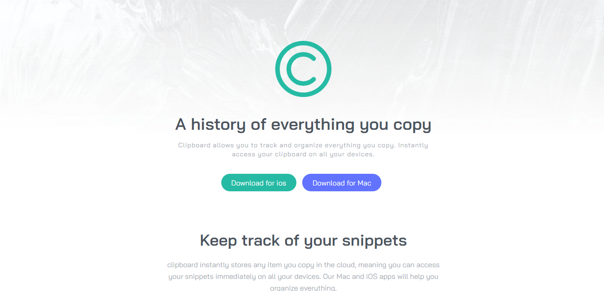

# Clipboard Landing Page using TailwindCSS
 
## Table of Content

 * [Overview of the Project](#overview-of-the-project)
      * [Goal of the project](#goal-of-the-project)
      * [Screenshot](#screenshot)
 * [Technologies I Used](#technologies-i-used)

# Overview of the Project
Its a basic Clipboard landing page made using Tailwind CSS. Its a responsive page which works in both Desktop and Mobile.

### Goal of the Project
The goal of this project to practice Tailwind CSS and to learn the basic skills and a approach to start using Tailwind.

## Screenshot

## Technologies I Used
* Tailwind CSS
